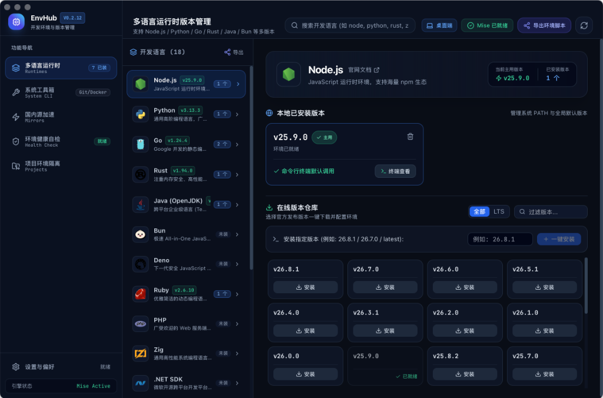
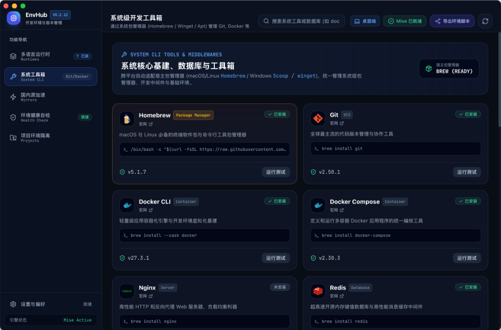
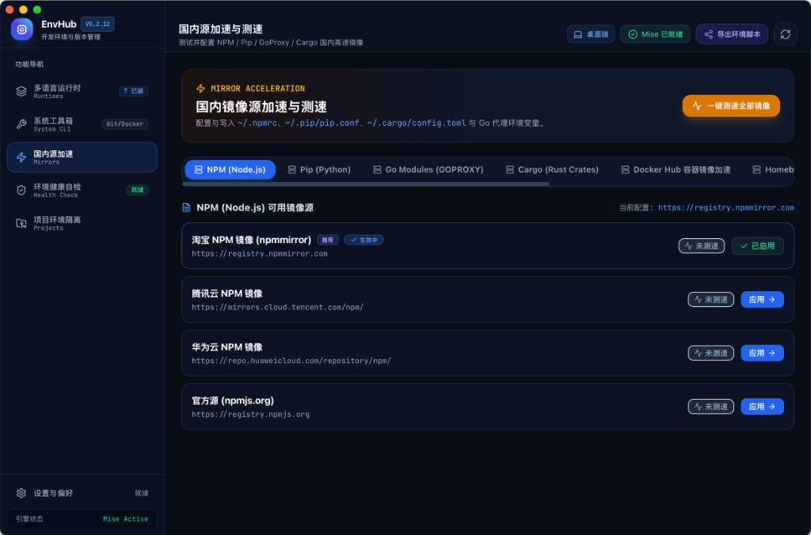
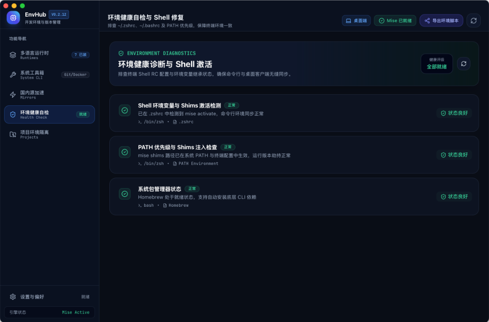
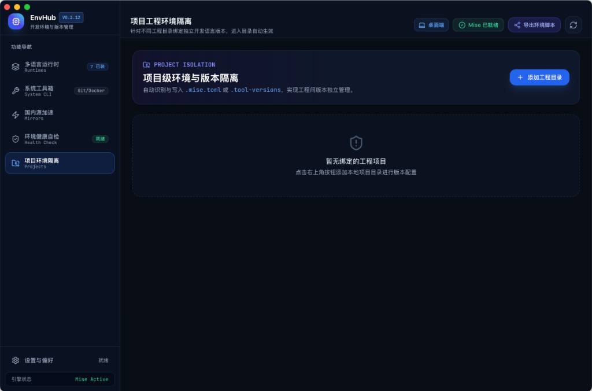

<div align="center">

# ⚡ EnvHub

**A modern, blazing-fast, cross-platform development environment and runtime version manager.**

<p align="center">
  <a href="./README.md">简体中文</a> | <a href="./README_EN.md">English</a>
</p>

[](LICENSE)
[](https://tauri.app/)
[](https://www.rust-lang.org/)
[](https://react.dev/)
[](https://www.typescriptlang.org/)
[](https://tailwindcss.com/)
[](https://mise.jdx.dev/)

</div>

---

## 📖 Introduction

**EnvHub** is a cross-platform desktop application designed for developers to manage multi-language runtimes and development environments. Built on top of **Tauri v2 (Rust) + React 18 + Tailwind CSS**, EnvHub seamlessly integrates the powerful, battle-tested **Mise CLI** engine under the hood.

Unlike resource-heavy Electron apps, EnvHub achieves **minimal resource footprint (~30-50MB RAM, ~10MB package size)** while delivering instant global/local version switching, domestic mirror speedup & latency benchmarking, system package management, and automatic shell environment synchronization.

---

## ✨ Features

- 🚀 **Full-Stack Runtime Version Management**: Easily install, coexist, and switch versions for Node.js, Python, Go, Rust, Java (OpenJDK/Temurin), Bun, Deno, Ruby, PHP, and more.
- 📦 **Project-Level Environment Isolation**: Automatically detect and manage `.mise.toml`, `.tool-versions`, or `package.json` in project directories for zero-friction version switching on `cd`.
- ⚡ **Mirror Acceleration & Latency Benchmarks**: Built-in mirror sources for NPM, Python Pip, Go Modules (GOPROXY), Cargo (Rust Crates), and Homebrew with real-time ping testing and 1-click configuration persistence.
- 🛠️ **System Developer Toolbox**: Unified abstraction over platform package managers (`brew` on macOS, `winget` on Windows, `apt/pacman` on Linux) to install Git, Docker CLI, CMake, Neovim, etc.
- 🔍 **Environment Health Check & Shell Fixes**: Automatically detect Shell RC files (`~/.zshrc`, `~/.bashrc`) and fix PATH inheritance issues for GUI applications on macOS/Linux with 1-click auto-repair.
- 💻 **Streaming Mini-Terminal**: Tokio asynchronous subprocess output capture with real-time log streaming and animated progress indicators.

---

## 📸 Screenshots

### 1. Multi-Language Runtime Version Manager
> Manage, download, and switch multiple versions of Node.js, Python, Go, Rust, Java, Bun, Deno, Ruby, PHP, and more. Support 1-click cross-platform environment export script.

<div align="center">
  
</div>

### 2. System CLI & Developer Toolbox
> Unified integration with host package managers (macOS/Linux Homebrew, Windows Scoop / Winget) to install, run, and test Git, Docker CLI, Docker Compose, Nginx, Redis, Neovim, etc.

<div align="center">
  
</div>

### 3. Mirror Acceleration & Speed Benchmarks
> Built-in mirrors for NPM, Pip, Go Modules, Cargo, Docker Hub, and Homebrew with real-time ping latency testing and 1-click config persistence.

<div align="center">
  
</div>

### 4. Environment Health Diagnostics & Shell Auto-Repair
> Diagnose terminal PATH inheritance, Shell RC (`~/.zshrc` / `~/.bashrc`) activation, and Shims priority, with 1-click automatic repair.

<div align="center">
  
</div>

### 5. Project-Level Environment Isolation
> Automatically scan and bind runtime versions to specific project workspaces (`.mise.toml`, `.tool-versions`), isolating project environments without polluting global setups.

<div align="center">
  
</div>

---

## 🏗️ Architecture

```
+-------------------------------------------------------------------------+
|                        EnvHub Desktop UI (React 18 + TS + Tailwind)     |
|  - Runtime Manager (Node, Python, Go, Rust, Java, Bun, Deno, etc.)       |
|  - Project Isolator (Auto-detect .mise.toml / .node-version & bind)     |
|  - System CLI Toolbox (Git, Docker, CMake via brew/winget/apt)          |
|  - Mirror Manager & Speedup (NPM / Pip / Go / Cargo / Brew)             |
|  - Environment Health Check (Shell RC injection & Shims diagnostic)     |
|  - Real-time Streaming Terminal Drawer (Live stdout/stderr stream)      |
+------------------------------------+------------------------------------+
                                     | Tauri IPC (invoke & event)
+------------------------------------v------------------------------------+
|                         Tauri 2.0 Rust Core Backend                     |
|  - env_helper: Cross-platform PATH inheritance & repair                 |
|  - mise_service: CLI detection, bootstrap, ls, install, use, uninstall  |
|  - project_service: Recursive directory scanner & config reader/writer  |
|  - system_service: OS detection & package manager routing               |
|  - mirror_service: Configuration file modifier & ping benchmarks        |
+------------------------------------+------------------------------------+
                                     | Subprocess Execution
+------------------------------------v------------------------------------+
|                             Underlying OS & CLI Tools                   |
|         [ mise CLI ]        |   [ brew / winget / apt ]                 |
+-------------------------------------------------------------------------+
```

---

## 🚀 Getting Started

### Prerequisites
- [Node.js](https://nodejs.org/) (>= 18.0.0)
- [Rust & Cargo](https://www.rust-lang.org/) (>= 1.75.0)

### 1. Clone the repository
```bash
git clone git@github.com:WnJee/EnvHub.git
cd EnvHub
```

### 2. Install dependencies
```bash
npm install
```

### 3. Web preview development mode (with realistic Mock service)
```bash
npm run dev
```
Open your browser at `http://localhost:1420` to explore the interface.

### 4. Run Tauri desktop application
```bash
npm run tauri dev
```

### 5. Build production installers
```bash
# Generates native installers (.dmg/.app for macOS, .msi/.exe for Windows, .deb/.AppImage for Linux)
npm run tauri build
```

---

## 📁 Directory Structure

```
├── src/                        # Frontend React 18 source
│   ├── components/             # Core UI components
│   │   ├── Sidebar.tsx         # Navigation sidebar
│   │   ├── Header.tsx          # Header with status & search
│   │   ├── RuntimeManager.tsx  # Multi-runtime management
│   │   ├── ProjectManager.tsx  # Project environment isolation
│   │   ├── SystemTools.tsx     # System CLI toolbox
│   │   ├── MirrorManager.tsx   # Mirror speedup & latency tester
│   │   ├── EnvHealth.tsx       # Shell health & PATH diagnostics
│   │   ├── InstallModal.tsx    # Live streaming install terminal
│   │   └── SettingsModal.tsx   # Engine settings & bootstrap
│   ├── services/
│   │   └── tauri.ts            # Tauri IPC bridge & Mock fallbacks
│   ├── types/                  # TypeScript interfaces
│   ├── App.tsx                 # Root layout & state coordinator
│   ├── index.css               # Tailwind CSS & developer dark theme
│   └── main.tsx                # App entrypoint
├── src-tauri/                  # Rust Tauri Backend (Tauri v2)
│   ├── src/
│   │   ├── commands/           # Modular Tauri IPC commands
│   │   │   ├── mise.rs         # Mise CLI interaction & streaming
│   │   │   ├── system.rs       # System environment & package managers
│   │   │   ├── mirrors.rs      # Mirror config parser & benchmarks
│   │   │   └── projects.rs     # Local project directory configs
│   │   ├── env_helper.rs       # Cross-platform environment resolver
│   │   ├── lib.rs              # App builder & command registration
│   │   └── main.rs             # Binary entrypoint
│   ├── Cargo.toml              # Rust crate dependencies
│   └── tauri.conf.json         # Tauri window & bundle configuration
├── package.json
├── README.md                   # Chinese Documentation
└── README_EN.md                # English Documentation
```

---

## 🤝 Contributing

Contributions are always welcome!
1. Fork the repository
2. Create a feature branch (`git checkout -b feature/AmazingFeature`)
3. Commit your changes (`git commit -m 'Add some AmazingFeature'`)
4. Push to your branch (`git push origin feature/AmazingFeature`)
5. Open a Pull Request

---

## 📄 License

This project is licensed under the [MIT License](LICENSE).
